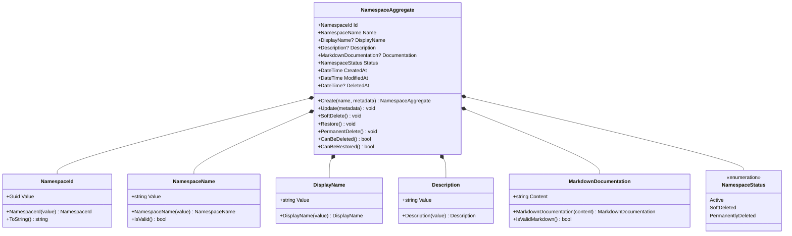
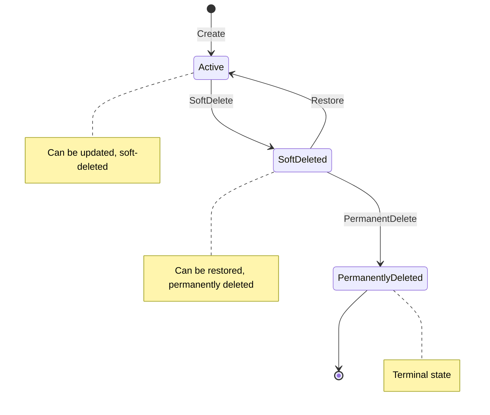

# Data Model: Namespace Management

**Feature**: Namespace Management for Schema Registry
**Date**: September 21, 2025
**Status**: Draft

## Domain Model Overview

The namespace management feature follows Domain-Driven Design principles with clear aggregate boundaries and explicit domain modeling.



## Aggregate Root: Namespace

### Purpose
The `NamespaceAggregate` serves as the aggregate root for namespace management, encapsulating all business rules and ensuring consistency of namespace operations.

### Properties

| Property | Type | Required | Description |
|----------|------|----------|-------------|
| Id | NamespaceId | Yes | Unique identifier for the namespace |
| Name | NamespaceName | Yes | Unique name for the namespace (immutable) |
| DisplayName | DisplayName? | No | Human-friendly display name |
| Description | Description? | No | Brief description of namespace purpose |
| Documentation | MarkdownDocumentation? | No | Detailed markdown documentation |
| Status | NamespaceStatus | Yes | Current lifecycle status |
| CreatedAt | DateTime | Yes | Timestamp of creation |
| ModifiedAt | DateTime | Yes | Timestamp of last modification |
| DeletedAt | DateTime? | No | Timestamp of soft deletion |

### Business Rules

1. **Name Uniqueness**: Namespace names must be unique across the entire system
2. **Name Immutability**: Once created, namespace names cannot be changed
3. **Lifecycle Management**: Only active namespaces can be soft-deleted
4. **Restoration Rules**: Only soft-deleted namespaces can be restored
5. **Permanent Deletion**: Only soft-deleted namespaces can be permanently deleted
6. **Cascade Operations**: All schema operations cascade to contained schemas

### Invariants

- Name cannot be null or empty
- Name must follow valid identifier rules (alphanumeric, hyphens, underscores)
- Status transitions must follow valid state machine
- CreatedAt and ModifiedAt must be valid timestamps
- DeletedAt must be null for active namespaces

## Value Objects

### NamespaceId
**Purpose**: Strongly-typed identifier for namespaces
**Implementation**: Wraps Guid value with domain-specific validation

### NamespaceName
**Purpose**: Enforces naming rules and uniqueness constraints
**Validation Rules**:
- Length: 1-100 characters
- Pattern: alphanumeric, hyphens, underscores only
- Case-insensitive uniqueness check
- No leading/trailing whitespace

### DisplayName
**Purpose**: Optional human-friendly name for UI display
**Validation Rules**:
- Length: 1-200 characters
- Allow spaces and special characters
- Trim whitespace

### Description
**Purpose**: Brief description of namespace purpose
**Validation Rules**:
- Length: 0-1000 characters
- Plain text content
- Trim whitespace

### MarkdownDocumentation
**Purpose**: Detailed documentation in markdown format
**Validation Rules**:
- Length: 0-50000 characters
- Valid markdown syntax
- Support for common markdown elements

## Domain Events

### NamespaceCreated
**Trigger**: When a new namespace is successfully created
**Data**: NamespaceId, Name, CreatedAt, CreatedBy

### NamespaceUpdated
**Trigger**: When namespace metadata is modified
**Data**: NamespaceId, UpdatedFields, ModifiedAt, ModifiedBy

### NamespaceSoftDeleted
**Trigger**: When namespace is soft-deleted
**Data**: NamespaceId, DeletedAt, DeletedBy, AffectedSchemas

### NamespaceRestored
**Trigger**: When soft-deleted namespace is restored
**Data**: NamespaceId, RestoredAt, RestoredBy, RestoredSchemas

### NamespacePermanentlyDeleted
**Trigger**: When namespace is permanently removed
**Data**: NamespaceId, PermanentlyDeletedAt, DeletedBy

## Repository Interface

```csharp
public interface INamespaceRepository
{
    Task<NamespaceAggregate?> GetByIdAsync(NamespaceId id, CancellationToken cancellationToken = default);
    Task<NamespaceAggregate?> GetByNameAsync(NamespaceName name, CancellationToken cancellationToken = default);
    Task<IEnumerable<NamespaceAggregate>> GetAllAsync(NamespaceFilter filter, CancellationToken cancellationToken = default);
    Task<bool> ExistsAsync(NamespaceName name, CancellationToken cancellationToken = default);
    Task SaveAsync(NamespaceAggregate aggregate, CancellationToken cancellationToken = default);
    Task DeleteAsync(NamespaceId id, CancellationToken cancellationToken = default);
}
```

## Entity Framework Configuration

### NamespaceEntity (Infrastructure)

```csharp
public class NamespaceEntity
{
    public Guid Id { get; set; }
    public string Name { get; set; } = string.Empty;
    public string? DisplayName { get; set; }
    public string? Description { get; set; }
    public string? Documentation { get; set; }
    public NamespaceStatus Status { get; set; }
    public DateTime CreatedAt { get; set; }
    public DateTime ModifiedAt { get; set; }
    public DateTime? DeletedAt { get; set; }

    // Navigation properties
    public ICollection<SchemaEntity> Schemas { get; set; } = new List<SchemaEntity>();
}
```

### Entity Configuration

```csharp
public class NamespaceEntityConfiguration : IEntityTypeConfiguration<NamespaceEntity>
{
    public void Configure(EntityTypeBuilder<NamespaceEntity> builder)
    {
        builder.ToTable("Namespaces");

        builder.HasKey(n => n.Id);

        builder.Property(n => n.Name)
            .IsRequired()
            .HasMaxLength(100);

        builder.HasIndex(n => n.Name)
            .IsUnique()
            .HasFilter("DeletedAt IS NULL");

        builder.Property(n => n.DisplayName)
            .HasMaxLength(200);

        builder.Property(n => n.Description)
            .HasMaxLength(1000);

        builder.Property(n => n.Documentation)
            .HasMaxLength(50000);

        builder.Property(n => n.Status)
            .HasConversion<string>();

        builder.Property(n => n.CreatedAt)
            .IsRequired();

        builder.Property(n => n.ModifiedAt)
            .IsRequired();

        // Soft delete filter
        builder.HasQueryFilter(n => n.Status != NamespaceStatus.PermanentlyDeleted);

        // Schema relationship with cascade delete
        builder.HasMany(n => n.Schemas)
            .WithOne(s => s.Namespace)
            .HasForeignKey(s => s.NamespaceId)
            .OnDelete(DeleteBehavior.Cascade);
    }
}
```

## Validation Rules

### Domain Validation (FluentValidation)

```csharp
public class NamespaceValidator : AbstractValidator<NamespaceAggregate>
{
    public NamespaceValidator()
    {
        RuleFor(n => n.Name)
            .NotEmpty()
            .Length(1, 100)
            .Matches(@"^[a-zA-Z0-9\-_]+$")
            .WithMessage("Name must contain only alphanumeric characters, hyphens, and underscores");

        RuleFor(n => n.DisplayName)
            .Length(1, 200)
            .When(n => n.DisplayName != null);

        RuleFor(n => n.Description)
            .Length(0, 1000)
            .When(n => n.Description != null);

        RuleFor(n => n.Documentation)
            .Length(0, 50000)
            .When(n => n.Documentation != null);
    }
}
```

## State Machine



## Event Sourcing Integration

### Marten Configuration

```csharp
public class NamespaceAggregate : IAggregate
{
    public Guid Id { get; private set; }
    public int Version { get; set; }

    // Apply event methods for Marten
    public void Apply(NamespaceCreated @event) { /* ... */ }
    public void Apply(NamespaceUpdated @event) { /* ... */ }
    public void Apply(NamespaceSoftDeleted @event) { /* ... */ }
    public void Apply(NamespaceRestored @event) { /* ... */ }
    public void Apply(NamespacePermanentlyDeleted @event) { /* ... */ }
}
```

### Event Stream

Events are stored in Marten event streams with the namespace ID as the stream identifier, enabling complete audit trail and state reconstruction.

---

## Domain Services

### NamespaceUniquenessService
**Purpose**: Ensures namespace name uniqueness across the system
**Dependencies**: INamespaceRepository

### NamespaceCascadeService
**Purpose**: Handles cascade operations for schemas when namespace is deleted/restored
**Dependencies**: ISchemaRepository, IEventBus

---

This data model provides a complete foundation for namespace management with proper domain modeling, event sourcing integration, and constitutional compliance.
