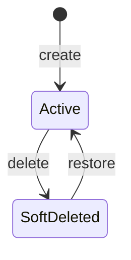

# Feature Specification: Namespace Management for Schema Registry

**Feature Branch**: `001-namespace`
**Created**: September 21, 2025
**Status**: Draft
**Input**: User description: "The user can create a namespace to group all related schemas. Each namespace have a unique name, an optional display name, description and markdown documentation. Namespaces can be soft-deleted and also restored"

## Execution Flow (main)

```text
1. Parse user description from Input
   → User wants namespace functionality for schema organization
2. Extract key concepts from description
   → Actors: Schema Registry clients
   → Actions: create, update, soft-delete, restore namespaces
   → Data: namespace name, display name, description, markdown documentation
   → Constraints: unique namespace names
3. For each unclear aspect:
   → ✅ RESOLVED: Internal service - no authorization required (microservice architecture)
   → ✅ RESOLVED: Flat namespace structure (no nested namespaces)
   → ✅ RESOLVED: Cascade soft delete - schemas are soft-deleted with namespace and can be accessed with deleted=true filter
4. Fill User Scenarios & Testing section
   → Clear user flows for CRUD operations and deletion lifecycle
5. Generate Functional Requirements
   → Each requirement covers namespace lifecycle operations
6. Identify Key Entities
   → Namespace entity with specified attributes
7. Run Review Checklist
   → All requirements clear for internal microservice usage
8. Return: SUCCESS (spec ready for planning)
```

---

## ⚡ Quick Guidelines

- ✅ Focus on WHAT users need and WHY
- ❌ Avoid HOW to implement (no tech stack, APIs, code structure)
- 👥 Written for business stakeholders, not developers

---

## User Scenarios & Testing *(mandatory)*

### Primary User Story

As a schema registry client, I want to organize schemas into logical namespaces through the Schema Registry service API so that I can better manage and categorize related schemas within my microservice architecture, making them easier to find and maintain. I need the ability to create namespaces with descriptive information, update them as needed, and manage their lifecycle including soft deletion and restoration when necessary.

### Acceptance Scenarios

1. **Given** I am a schema registry client, **When** I create a new namespace with a unique name "payment-schemas" via the API, **Then** the namespace is created and available for schema assignment
2. **Given** I have an existing namespace, **When** I update its display name and description via the API, **Then** the changes are saved and reflected in the namespace information
3. **Given** I have a namespace I no longer need, **When** I soft-delete it via the API, **Then** the namespace is marked as deleted but can be restored later
4. **Given** I have a soft-deleted namespace, **When** I choose to restore it via the API, **Then** the namespace becomes active again with all its previous information
5. **Given** I try to create a namespace via the API, **When** I use a name that already exists, **Then** the system prevents creation and returns an appropriate error response
6. **Given** I have a namespace containing schemas, **When** I soft-delete the namespace via the API, **Then** all schemas within are automatically soft-deleted and can be accessed using `deleted=true` filter
7. **Given** I have a soft-deleted namespace with soft-deleted schemas, **When** I restore the namespace via the API, **Then** both the namespace and all its schemas are restored to active status
8. **Given** I have multiple namespaces in the system, **When** I request a list of active namespaces via the API, **Then** only active (non-deleted) namespaces are returned
9. **Given** I have both active and soft-deleted namespaces, **When** I request namespaces with `deleted=true` filter, **Then** both active and soft-deleted namespaces are returned with their status clearly indicated



### Edge Cases

- When a namespace containing schemas is soft-deleted, all schemas within are automatically soft-deleted and can be accessed with `deleted=true` filter
- When a namespace is soft-deleted, its name remains reserved (prevents name reuse while deleted)
- Namespace names must follow pattern: lowercase letters (a-z), numbers (0-9), and hyphens (-), with maximum 40 characters
  - Valid examples: "user-service", "payment-v2", "analytics123", "core"
  - Invalid examples: "User-Service" (uppercase), "-payment" (starts with hyphen), "user--service" (consecutive hyphens)
- Display names must be trimmed and have maximum 80 characters
- Descriptions must be trimmed and have maximum 1000 characters
- Documentation can have maximum 10kb (10,240 characters)
- System must handle concurrent operations safely to prevent race conditions
- When namespace name contains only whitespace or is empty, system rejects creation with validation error
- When display name or description contains only whitespace, system trims to empty string and accepts
- When attempting to restore an already active namespace, system returns appropriate error
- When attempting to soft-delete an already soft-deleted namespace, system returns appropriate error
- When multiple clients attempt to create namespace with same name simultaneously, only one succeeds
- When a namespace contains schemas that are referenced by other systems, soft-deletion maintains referential integrity while marking the namespace as inactive

## Requirements *(mandatory)*

### Functional Requirements

- **FR-001**: System MUST allow users to create a new namespace with a unique name
- **FR-002**: System MUST validate that namespace names are unique across the entire system
- **FR-003**: System MUST allow users to specify an optional display name for a namespace
- **FR-004**: System MUST allow users to provide an optional description for a namespace
- **FR-005**: System MUST allow users to add optional markdown documentation to a namespace
- **FR-006**: System MUST allow users to update the display name, description, and documentation of existing namespaces
- **FR-007**: System MUST provide the ability to soft-delete a namespace, marking it as deleted while preserving its data
- **FR-008**: System MUST allow users to restore a previously soft-deleted namespace

- **FR-009**: System MUST display namespace information including name, display name, description, and documentation
- **FR-010**: System MUST track the creation and modification timestamps for namespaces
- **FR-011**: System MUST distinguish between active and soft-deleted namespaces in listings
- **FR-012**: System MUST implement a flat namespace structure with no support for nested or hierarchical namespaces
- **FR-013**: System MUST cascade soft-delete operations: when a namespace is soft-deleted, all schemas within that namespace are automatically soft-deleted and can be accessed using a `deleted=true` filter
- **FR-014**: System MUST cascade restore operations: when a soft-deleted namespace is restored, all schemas that were soft-deleted with the namespace are automatically restored
- **FR-015**: System MUST reserve soft-deleted namespace names to prevent name reuse while deleted
- **FR-016**: System MUST validate namespace names using pattern "my-namespace123" (lowercase letters, numbers, hyphens) with maximum 40 characters
- **FR-017**: System MUST trim and validate display names with maximum 80 characters
- **FR-018**: System MUST trim and validate descriptions with maximum 1000 characters
- **FR-019**: System MUST validate documentation with maximum 10kb (10,240 characters)
- **FR-020**: System MUST handle concurrent operations safely to prevent race conditions and data corruption
- **FR-021**: System MUST return appropriate HTTP status codes and error messages for validation failures (400 Bad Request for invalid input, 409 Conflict for duplicate names)
- **FR-022**: System MUST return descriptive error messages that clearly indicate which validation rule was violated
- **FR-023**: System MUST return 404 Not Found when attempting operations on non-existent namespaces
- **FR-024**: System MUST return 422 Unprocessable Entity when attempting invalid state transitions (e.g., restoring active namespace, soft-deleting already soft-deleted namespace)
- **FR-025**: System MUST maintain an audit trail of all namespace operations including creation, updates, soft-deletions, and restorations
- **FR-026**: System MUST record the operation type, timestamp, and any relevant metadata for each namespace change
- **FR-027**: System MUST provide the ability to query the audit trail for a specific namespace to understand its change history

### Non-Functional Requirements

- **NFR-001**: System MUST support at least 10,000 active namespaces without performance degradation
- **NFR-002**: Namespace operations (create, read, update) MUST complete within 100ms under normal load
- **NFR-003**: System MUST maintain 99.9% availability for namespace operations
- **NFR-004**: Namespace listing operations MUST support pagination to handle large numbers of namespaces efficiently
- **NFR-005**: System MUST be horizontally scalable to handle increased namespace management load
- **NFR-006**: All namespace data MUST be persisted durably to prevent data loss

### Key Entities *(include if feature involves data)*

- **Namespace**: Represents a logical grouping container for schemas with the following attributes:
  - Name (required, unique): String, 1-40 characters, pattern: `^[a-z0-9-]+$` (lowercase letters, numbers, hyphens only)
  - Display Name (optional): String, 0-80 characters after trimming, human-friendly name for display purposes
  - Description (optional): String, 0-1000 characters after trimming, brief description of the namespace purpose
  - Documentation (optional): String, 0-10,240 characters, markdown-formatted detailed documentation
  - Status: Enum (Active, SoftDeleted)
  - Created timestamp: ISO 8601 datetime, when the namespace was originally created
  - Modified timestamp: ISO 8601 datetime, when the namespace was last updated
  - Deleted timestamp: ISO 8601 datetime, when the namespace was soft-deleted (null if never deleted)

---

## Review & Acceptance Checklist

### Content Quality

- [x] No implementation details (languages, frameworks, APIs)
- [x] Focused on user value and business needs
- [x] Written for non-technical stakeholders
- [x] All mandatory sections completed

### Requirement Completeness

- [x] No [NEEDS CLARIFICATION] markers remain
- [x] Requirements are testable and unambiguous
- [x] Success criteria are measurable
- [x] Scope is clearly bounded
- [x] Dependencies and assumptions identified

---

## Execution Status

Updated by main() during processing

- [x] User description parsed
- [x] Key concepts extracted
- [x] Ambiguities marked
- [x] User scenarios defined
- [x] Requirements generated
- [x] Entities identified
- [x] Review checklist passed

---
